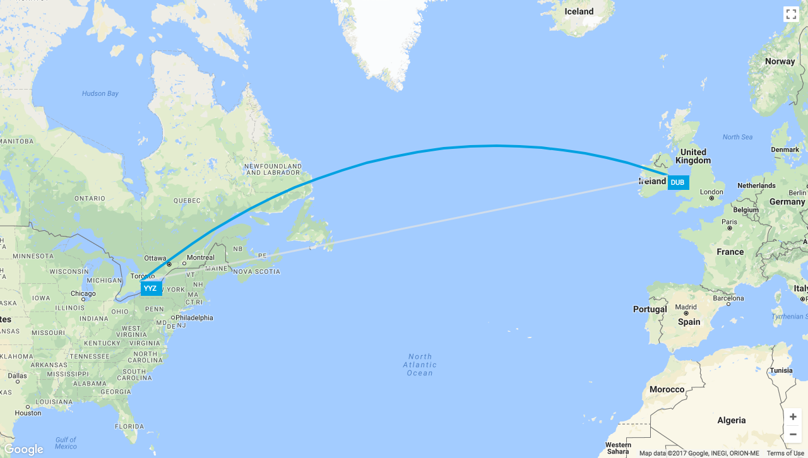

## About
The project is an example how to render geodesic polyline on Google maps by using [google-map-react](https://github.com/istarkov/google-map-react) package.



In the following code the `onGoogleApiLoaded` callback is using to get access to the loaded map and render a polyline on top of the map as showed on the image above.

``` javascript
  <GoogleMap
    // ...
    onGoogleApiLoaded={({map, maps}) => this.renderPolylines(map, maps)}>
    <!-- Markers here -->
  </GoogleMap>

  renderPolylines (map, maps) {
    let geodesicPolyline = new maps.Polyline({
      path: markers,
      // ...
    })
    geodesicPolyline.setMap(map)
  }
```

## How to run the project on local environment

There are two examples of different methods how to render polyline on Google maps in the 'google-map-react-polyline-example/examples' folder

`basic` - use callback inside Map component

`polyline-as-component` - emulate React component behavior for polyline

To get the project on local environment clone project's repository and use one of the following commands

``` bash
cd examples/basic
#or
cd examples/polyline-as-component
```

Update the line with valid google maps api key

`bootstrapURLKeys={{key: 'PUT GOOGLE MAPS KEY HERE'}}`

in the `src/components/Map.js` file.

Install required dependencies using yarn or npm and run project

``` bash
yarn install
yarn start
```

To see the result of polyline rendering open `http://localhost:3000/` in the browser

## License

[MIT](https://github.com/Dooffy/google-map-react-polyline-example/blob/master/LICENSE)